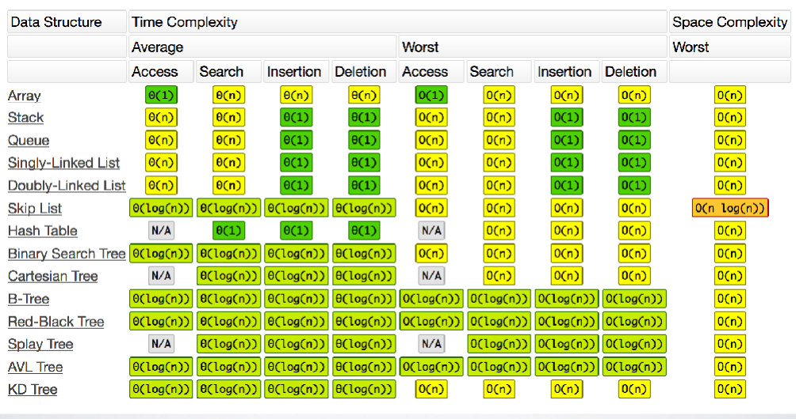
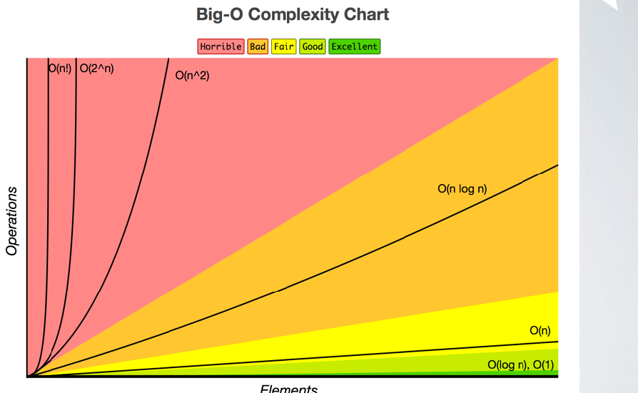

# Lecture 2 Notes 
###### Theory and Images could be based on the Lecures materials provided by Dt. Simon Wells at Napier university



Both pictures taken from bigocheatsheet.com


Not every problem is solvable using a computr. Computer science is all about working out the characteristics and performance of problems that are (not) solvable by computers. 

We have algorithm for:
* Calculating result
* Data processing
* Solving programming problems 
* Artificial Intelligence - (Path-finding , Machine Learning , Neural Nets). 

* Algorithm: finite list of instructions that can be followed to solve a problem. 


### Complexity notations

* Big Oh gives the upper bound
* Big Ω (Omega) gives the lower bound
* There is Big Ɵ (Theta) notation to asymptotically bound the growth to within constant factors above and below

Each notation can be used to reason about the best, worst & average case of performance. 

### An algorithm can run in 

* Constant time ```O(1)```:  if it requires the same amount of time regardless of input size.
* Linear time   ```O(n)```: if the time it takes to execute a specific set of instructins, is directly proportional to the size of the input. An example could be: check if our ArrayList, or Queue contains a specific element x. 
* Quasilinear time ```O(n log n)```
* Logarithmic time```O(logN)```: the time is proportuioanl to the logarithm of the input size. An example could be the Binary Search algorithm. 
* Quadratic time  ```O(n^2)```: the execution time is proportional to the square of the input size. 
* Exponential time ```O(2^n)```: 
* Factorial time ```O(n!)```: for example: generate all the permutation of a list of elements. 

### Big O notations

Big referes to the order associated wih the perfomance, (degree of complexity), so o(N) si read "The order of n". 
A function Big O notation is generally determined by how it responds to different inputs. 

### Turing machine

The turing's machine is a tape of infinite lenght (though like memory with each cell laid out next to the other in a long line),
with a state register and a finite table of instructions to execute. 

The machine follows do the following  steps: read tape, decode information, execute any instructuons and repeat. 

* Computability: a mathematical problem is computable if it can be solved in priciple by a computing device. 


