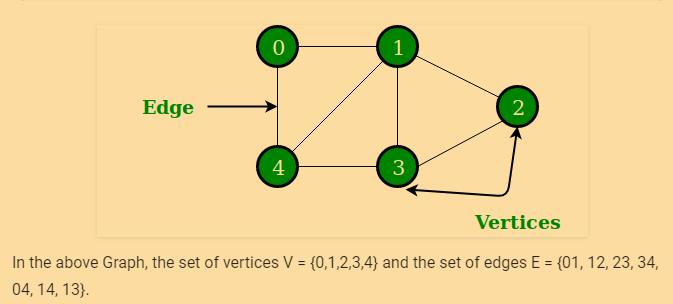

## Graph

Is a non/linear data structure consisting of nodes and edges. The nodes are also called vertices and the edges are lines
or arcs that connect any two nodes in the graph.

### Formal Definition of a graph
A Graph consists of a finite set of vertices(or nodes) and set of Edges which connect a pair of nodes.


### kind of Graphs

* **Undirected Graph** :order of the vertices in the pairs does not matter.
* **Directed Graph**: order of the vertices matter. Graphically we use arrows for the arcs between vertices.
An arrow from u to v id drawn only if 
(u,v) is in the Edge set.
* **Cycling Graph**:A cyclic graph is a directed graph with at least one cycle. 
A cycle is a path along the directed edges from a vertex to itself. The vertex labeled graph above as several cycles. One of them is 2 » 4 » 5 » 7 » 6 » 2
* **Weighted Graph**: is a labelled graph where the label is usually used for arithmetic operators.
* **Directed acyclic graph**: graphically present with arrows that indicates a path between an edge a to and edge b. As the
name suggest, it does not contains and cycle / loop.


### Graph representations

Two are the most commonly used representations of a graph.
1. Adjacency Matrix
2. Adjacency List

* [Source - Grpah representation Geeks for Geeks](https://www.geeksforgeeks.org/graph-and-its-representations/)
```
// A utility function to add an edge in an 
// undirected graph. 
void addEdge(vector<int> adj[], int u, int v) 
{ 
    adj[u].push_back(v); 
    adj[v].push_back(u); 
} 
  
// A utility function to print the adjacency list 
// representation of graph 
void printGraph(vector<int> adj[], int V) 
{ 
    for (int v = 0; v < V; ++v) 
    { 
        cout << "\n Adjacency list of vertex "
             << v << "\n head "; 
        for (auto x : adj[v]) 
           cout << "-> " << x; 
        printf("\n"); 
    } 
} 
  
// Driver code 
int main() 
{ 
    int V = 5; 
    vector<int> adj[V]; 
    addEdge(adj, 0, 1); 
    addEdge(adj, 0, 4); 
    addEdge(adj, 1, 2); 
    addEdge(adj, 1, 3); 
    addEdge(adj, 1, 4); 
    addEdge(adj, 2, 3); 
    addEdge(adj, 3, 4); 
    printGraph(adj, V); 
    return 0; 
} 
```