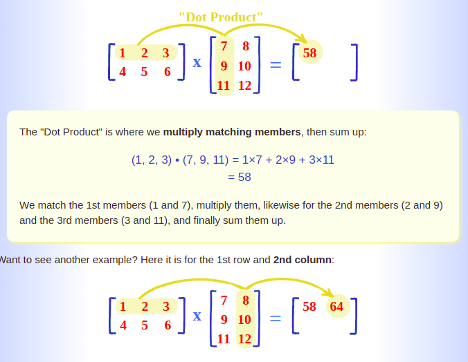

## Matrix

For competitive programming and interviw preparation, talking about matrix we must at least know how to implement the following operation:

* Search a number n in a matrix.
* FInd trasponse of a given matrix. 
* Sum between two matrix.
* Multiplication between matrix.
* Iterate Main and secondary diagonal.
* Iterate all the diagonals of a matrix. 
* Matrix rotation. 
* Spiral Traversal of a matrix
* Count number of squares in a matrix. 


####  Definitions and tutorial conventions

* Order of a matrix = No. of rows × No. of columns.
* n: number of rows
* m: number of columns. 

#### Transpose of a matrix

Given a a matrix n x m , it's transponse will be m x n;

```
void transpose(int mat[n][m])
{
    int transponse_matrix[m][n];

    for(int i =0; i< n; i++)
    {
        for(int j =0; i <m; j++)
        {
            transponse_matrix[i][j] = mat[j][i];
        }
    }
    // Print the trasponse

    for(int i =0; i< n; i++)
    {
        for(int j =0; i <m; j++)
        {
            cout << transponse_matrix[i][j] <<" ";
        }
        cout << endl;
    }
}
```

#### Matrices Additition, subtraction, multiplication 

Having two matrix a and b and a result matrix c:

```
// Addition 
for(int i=0; i < n; i++)
{
    for(int j=0; j < m; j++)
        c[i][j] = a[i][j] + b[i][j];
}
```
```
// Subtraction between a and b; 
for(int i=0; i < n; i++)
{
    for(int j=0; j < m; j++)
        c[i][j] = a[i][j] - b[i][j];
}
```

* **Rule for multiplication** between a and b: number of columns of a must be equal to the number of rows of b; 

m: rows of matrices a;
p: columns of matrices b
```
for i in 0 to m-1
    for j in 0 to p-1
        Cij = 0
            for k in 0 n-1
                Cij += aik*bkj
```


###### Source picture: mathisfun.com

* Multiplication of matrices is non-commutative which means A*B ≠ B*A.

#### Matrix rotation

A typical coding challenge that I have met many times is:
Having a NxN matrix, do a anti-clock wise rotation of 90 degrees.

```
//Original matrix:
1 2 3 4 
5 6 7 8 
9 10 11 12
13 14 15 16

// Matrix rotated by 90 degrees (anti-clock wise rotatino)
4 8 12 16
3 7 11 12
2 6 10 14
1 5 9 13
```
###### possible solutions: 
 
 1. the simplest one is to use a temporary matrix and then assign the values of the temporary values to our original matrix.
 2. Do a ration in **space complexity O(1)**, so without using extra space. 

```
mat [N][N];
temp [N][N];

// Copy original matrix into temporary one
for(int i =0; i < N; i++)
{
    for(int j=0; j< N; i++)
        temp[i][j] = mat[i][j];
}

for(int i =0; i < N; i++)
{
    for(int j=0; j< N; i++)
        mat[i][j] = temp[j][N-i-1];   
}
```

```
void rotateMatrix(int mat[][N])
{
    for(int i =0; i< N /2; i++)
    {
        for(int j =i; j < N-i-1; j++)
        {
            // Store current cell in temporary variable
            int temp = mat[i][j];

            // Move values from right to top
            mat[i][j] = mat[j][N-1-i];

            // moves values from bottom to right
            mat[j][N-1-i] = mat[N-1-i][N-1-j];

            // move values from left to bottom
            mat[N-1-i][N-1-j] = mat[N-1-j][i];

            // assign temporary variable to th matrix

            mat[N-1-j][i] = temp;
        }
    }
}
```


#### Count number of squares in a matrix

Having a matrix MxN:

1. If M > N : swap values; 
2. Return the Total number of squares using this formula:  ```m * (m+1) * (2m+1)/6 + (n-m) * m * (m+1)/```

#### Spiral Traversal of a matrix 


Output : 1 2 3 4 8 12 16 15 14 13 9 5 6 7 11 10

```
// k - starting row index
// m - ending row index
// l - starting column index
// n - ending column index
//i - iterator
void print_spiral(A[][], m, n)
{
    k = 0, l = 0
    while (k < m && l < n)  
    {
        /* Print the first row from the remaining rows */
        for (i=l to n-1)
            print(A[k][i])  
        k++
  
        /* Print the last column from the remaining columns */
        for (i = k to i = m-1 )
            print(A[i][n-1])  
        n-- 
  
        /* Print the last row from the remaining rows */
        if ( k < m) 
        {
            for (i = n-1; i >= l; --i)   
                print(A[m-1][i]) 
            m--
        }
  
        /* Print the first column from the remaining columns */
        if (l < n) :
        {
            for (i = m-1; i >= k; --i)   
                print(A[i][l])   
            l++
        }
    }
}
```
###### Source : Geeks for geeks
