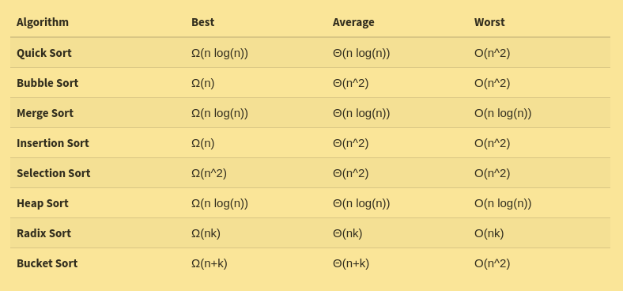

## Pointers

**Pointer:** variable that store  the memory address of another variable.
[But how do we use them?](https://www.geeksforgeeks.org/pointers-c-examples/)

## Sorting

* **Sorting:** arranging the elements of a list or collection in creaseing or decreasing order of some property. 


##  Sorting Algorith classification
We classify the sorting algorithm considering five characteristics:

1. **Time complexity**
2. **Space complexity**
3. **Stability:** If we will have two equals elements in the list, the same order of the two equals elements in the sorted list will be respected. Think about a set of cards where we have two versions of the same number, in a black card or red card, we have 2(black), 6 (red), 6 (black), 1(black). The sorteed list will be 1(black), 2(black), 6(red) and 6(black) 
4. **Internal or Extenral sort:** In interal sorts all element to sort are in the main memory (RAM), external sort, we have to fetch the data to sort from external resources, like the Hard Disk. 
5. **Nature of the algorithm:** Recursive or Non-recursive algorithm.  

Time complexity of the most popular sorting algorithms:

###### Source: interviewBit.com

* **Order stastics**: The ith order statistic of a set of n numbers is the ith smallest number in the set. 


## Insertion Sort

Insertion sort is a simple sorting algorithm that works the way we litterally sort playing cards in our hands
* Best case time complexity: O(N)
* Worst case time complexity: 0(N^2)
* Space complexity: O(1)


[Insertion sort lecture](https://www.geeksforgeeks.org/insertion-sort/)
###### Source: wikipedia.org
```
INSERTION-SORT(A)
   for i = 1 to n
   	key ← A [i]
    	j ← i – 1
  	 while j > = 0 and A[j] > key
   		A[j+1] ← A[j]
   		j ← j – 1
   	End while 
   	A[j+1] ← key
  End for 
```

## Merge Sort

Merge sort is one of the most efficient sorting algorithms. It works on the principle of Divide and Conquer. Merge sort repeatedly breaks down a list into several sublists until each sublist consists of a single element and merging those sublists in a manner that results into a sorted list.

* Average case: O(n log n)
* [How to implement it](https://www.geeksforgeeks.org/merge-sort/)

###### Source: wikipedia.org

## Quick sort

* worst-case time: O(n^2)
* Best case: O(n log n)
* [View the lesson](https://www.geeksforgeeks.org/quick-sort/)

###### Source: wikipedia.org

## Selection Sort

* Average time complexity: O(n^2)
* [How to implement it](https://www.geeksforgeeks.org/selection-sort/)

###### Source: wikipedia.org
```
void selectionSort(int arr[], int n)
{
	int i, j, smallest_element_index;
	for(i=0; i< N-1; i++)
	{
		smallest_element_index = 1;
		for(j = i+1; j<N; j++)
		{
			if(arr[j] < arr[smallest_element_index]);
				smallest_element_index = j;
			swap(&arr[smallest_element_index], &arr[i]);
		}
	}
}
```
## Bubble sort

* [How to implement it](https://www.geeksforgeeks.org/bubble-sort/)


## Heapsort

Heapsort is a comparison based sorting technique baseed on Binary Heap data structure.
It runs in O(n log n).

Complete Binary Tree: binary tree with all the levels full, expect possibily the last and all nodes are as far left as possible. 

Binary Heap: Complete Binary Tree where the root element can be the smallest (This is called Min Binary Heap) or the biggest one (Max Binary Heap).


Viewing a heap as tree, we define the **height of a node** in a heap to be the number of edges on the longest simple downward path from the node to a lead.

Height of an Heap: Height of the root element. 
###### Source: wikipedia.org

## Merge two arrays having a third sorted array

[Video-Tutorial](https://www.youtube.com/watch?v=xF3TU-QlhJQ&feature=youtu.be)