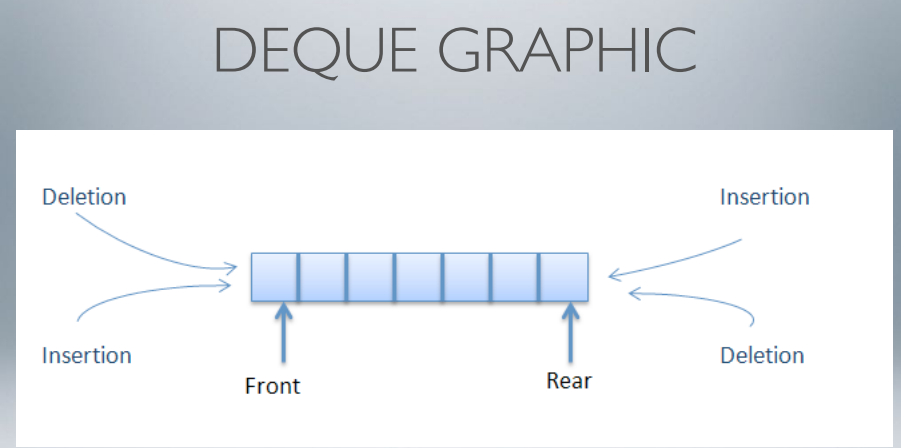
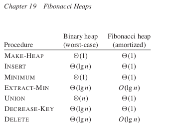

# Stack - Queue - Dequeue

### Warning:

Before to start to read section, be familiar with the concept of 
* Indexing 
* array and vectors.
 
### Did you know...
We have a shorter way to iterate thourgh an array / vector than traditional for loop?
```
// Traditional iteration of a vector
for (int i = 0; i < v.size(); i++) {
  cout << v[i] << "\n";
}
// Shorter way
for (auto x : v) {
  cout << x << "\n";
}
```

### Applications of the Strack
* Infix to Postfix / Prefix conversion
* Undo / redo operation
* Topological sorting (for graph)
* Balancing of Symbols
* Used to implement the N queen problem, sudoku solver or Knight tour problem. 

```
// Author: Davide Pollicino
// Date: 08/01/2019

#include <iostream>
#include <stack>

using namespace std;

void print_stack(stack <int> stackImplementation);
  
int main ()
{
  stack <int> stackArray;
  // Add an element on top of the stack
  stackArray.push(1);
  stackArray.push(2);
  stackArray.push(3);

  // Adds a new element at the top of the stack, above its current top element.
  stackArray.emplace(4);
  stackArray.push(5);

  cout << "Size: " << stackArray.size() << endl;

  print_stack(stackArray);
}

// Display element of the Stack
void print_stack(stack <int> stackArray)
{
  while(!stackArray.empty())
  {
      cout << stackArray.top() << endl;
      stackArray.pop();
  }
}
```

## Stack(LIFO), Queue(FIFO), Binary Heap

Even if you probably understimate the value of the se two Data structures, they are used in the daily life.

### Stack
* Push: add in iteam in the stack (If the stack is full: Overflow condition)
* Pop: removes an iteam from the stack. (If we pop without every pushed: Underflow condition) 
* Peek or Top: : Returns the element on the top of the stack, but does not remove it.
* isEmpty(): returns True if Stack is empty, false.


## How to implement a stack using array or Linked list

We can implement a stack using also an array, vector or Linked list (using ArrayList in Java and list in Python).
Otherwise, we use the stack<typed> id_of_stack from the C++ STL  ```#include<stack>```.

When implemetning a stack with an array, with maintain a top variable that points to the top of the array. The pop variable will just be an index of the array; 
* If we do a push(): pop++;
* If we do a pop(): pop--

```
// Define always top = -1;
// Pay attention to underflow and overflow; 
void push(int element)
{
  if(top == size_array-1)
  {
    cout<<"Array full, manage the stack with dynamic array next time";
    return; 
  }

  top++;
  stack[top] == element; 
}

int pop()
{
  if(pop == -1)
  {
    cout<< "Stack is empty";
    return -1; 
  }
  int element_removed = stack[top];
  top--;
  return element_removed; 
}
```

We can also implement a stack using a linked list;
Most of the times, the stack is implemented using a single linked list. For this reason, we keep a referent to the head of the linked list; 
```
void push(int element, Node *head)
{
  Node *new_node = new Node(element);
  new_node->next = head;
  
  head = new_node; 
}

Node* pop()
{
  if(head == NULL)
    return; 

  int result = head->data;
  Node *old_head = head;
  head = head->next;
  free(old_head);

  return head;
}
```


## Infix to Postfix conversion using Stack

* **Infix expression:** operator is between every pair of operands: a + b;
* **Postfix expression:** operator is folloed by the pair of operands. 

The compiler scans the expression either from left to right or from right to left. 

**Convert an infix expression to postfix**

```
int prec(char c)
{
  if(c == '^')
    return 3;
  else if(c == '*' || c == '/')
    return 2;
  else if(c== '+' || c == '-')
    return 1;
  return -1;
}

void infixToPostfix(string s)
{
  stack<char> s;
  string ns = "";

  for(int i=0; i < s.size(); i++)
  {
    // If a the character is an operands
    if((s[i] >= 'a' && s[i] <= 'z')||
          (s[i] >= 'A' && s[i] <= 'Z'))
      ns+=s[i];

    // If we have an open parenhesis '('
    else if(s[i] == '(')
      st.push('(');

    // If we have a ')', pop and print until we do not get a '('
    else if(s[i] == ')')
    {
      while(st.top() != 'N' && st.top() != '(')
      {
        char c = st.top();
        st.pop();
        ns += c;
      }
      if(st.top() == '(')
      {
        char c = st.top();
        st.pop();
      }
    }

    // The caracter is an operator
    else
    {
      while(st.top() != 'N' && prec(s[i] <= prec(st.top()))
      {
        char c = st.top();
        st.[op();
        ns += c;
      }
      st.push(s[i]);
    }
  }

  // Pop all elemetn from stack
  while(st.top() != 'N')
  {
    char c = st.top();
    st.pop();
    ns +=c;
  }
  cout << ns;
}

// Source: Geeksforgeeks
```

## Find Min element at every pop operation in O(1) time

We use an additional stack where we store the min element of the stack in chronologica order. 
The algorithm works in this way: 
1. Create your stack and supporting stack
1.1 if supporting stack and mainStack are both empty: add the same element to both
2. Every time that you insert / **push** a new element in your stack:
    2.1 if top(stack) < top (supporting stack)
        2.2 Push in supporting stack

3. Every time that you **pop** from the main stack, if popElement of the Main Stack  == top of supporting stack, pop element from the supporting stack (that will be your min element).

* [Find Min element at every pop operaton in O(1) but with additional space](https://www.youtube.com/watch?time_continue=515&v=ufwPuyxkNVE&feature=emb_title)
* [Find Min element at every pop operation in O(1) space and time](https://www.geeksforgeeks.org/design-a-stack-that-supports-getmin-in-o1-time-and-o1-extra-space/)


```/* Return true if expression has balanced  
       Parenthesis */
    static boolean areParenthesisBalanced(char exp[]) 
    { 
       /* Declare an empty character stack */
       stack st=new stack(); 
       
       /* Traverse the given expression to  
          check matching parenthesis */
       for(int i=0;i<exp.length;i++) 
       { 
            
          /*If the exp[i] is a starting  
            parenthesis then push it*/
          if (exp[i] == '{' || exp[i] == '(' || exp[i] == '[') 
            st.push(exp[i]); 
       
          /* If exp[i] is an ending parenthesis  
             then pop from stack and check if the  
             popped parenthesis is a matching pair*/
          if (exp[i] == '}' || exp[i] == ')' || exp[i] == ']') 
          { 
                   
              /* If we see an ending parenthesis without  
                 a pair then return false*/
             if (st.isEmpty()) 
               { 
                   return false; 
               }  
       
             /* Pop the top element from stack, if  
                it is not a pair parenthesis of character  
                then there is a mismatch. This happens for  
                expressions like {(}) */
             else if ( !isMatchingPair(st.pop(), exp[i]) ) 
               { 
                   return false; 
               } 
          } 
            
       } 
          
       /* If there is something left in expression  
          then there is a starting parenthesis without  
          a closing parenthesis */
        
       if (st.isEmpty()) 
         return true; /*balanced*/
       else
         {   /*not balanced*/
             return false; 
         }  
    }  

```

##  Evaluation of Prefix
```
Input: + * 10 2 3
Output: 23 | because: [(10*2) +3]
```

**While  We iterate from right to left** 
1. If character at P is an operand, push it to stack
2. If the character at P is an operat, pop two element from the stack, and operate these element according to the operator, and push the result back to the stack.

```
  bool isOperand(char c)
  {
    // Returns true if it is a character
    return isdigit(c);
  }

  double evaluatePrefix(string expression)
  {
    stack<double>s;

    for(int i= expression.size()-1; i >=0; i--)
    {   
      // Push operand to the stack
      if(isOperand(expression[j]))
        s.push(expression[i] - '0');

      else
      {
          // Because it is not an operand, get the two operands
          double o1 = s.top();
          s.pop();
          double o2 = s.top();
          s.pop();

          switch(expression[i])
          {
            case '+':
              s.push(o1+o2);
            break;

            case '-':
              s.push(o1 - o2);
            break;

            case '*':
              s.push(o1*o2);
            break;

            case '/':
              s.push(o1/o2):
            break;
          }
      }
      return s.top();
    }
  }
```


## Evaluatio of Postfix


## Infix to Postfix 

* Infix expression: operator is between pair of operands
* postfix : operator is followed for every pair of operands 

```

/* C++ implementation to convert infix expression to postfix*/
// Note that here we use std::stack  for Stack operations 
#include<bits/stdc++.h> 
using namespace std; 
  
//Function to return precedence of operators 
int prec(char c) 
{ 
    if(c == '^') 
    return 3; 
    else if(c == '*' || c == '/') 
    return 2; 
    else if(c == '+' || c == '-') 
    return 1; 
    else
    return -1; 
} 
  
// The main function to convert infix expression 
//to postfix expression 
void infixToPostfix(string s) 
{ 
    stack<char> st; 
    st.push('N'); 
    int l = s.length(); 
    string ns; 
    for(int i = 0; i < l; i++) 
    { 
        // If the scanned character is an operand, add it to output string. 
        if((s[i] >= 'a' && s[i] <= 'z')||(s[i] >= 'A' && s[i] <= 'Z')) 
        ns+=s[i]; 
  
        // If the scanned character is an ‘(‘, push it to the stack. 
        else if(s[i] == '(') 
          
        st.push('('); 
          
        // If the scanned character is an ‘)’, pop and to output string from the stack 
        // until an ‘(‘ is encountered. 
        else if(s[i] == ')') 
        { 
            while(st.top() != 'N' && st.top() != '(') 
            { 
                char c = st.top(); 
                st.pop(); 
               ns += c; 
            } 
            if(st.top() == '(') 
            { 
                char c = st.top(); 
                st.pop(); 
            } 
        } 
          
        //If an operator is scanned 
        else{ 
            while(st.top() != 'N' && prec(s[i]) <= prec(st.top())) 
            { 
                char c = st.top(); 
                st.pop(); 
                ns += c; 
            } 
            st.push(s[i]); 
        } 
  
    } 
    //Pop all the remaining elements from the stack 
    while(st.top() != 'N') 
    { 
        char c = st.top(); 
        st.pop(); 
        ns += c; 
    } 
      
    cout << ns << endl; 
  
} 
  
//Driver program to test above functions 
int main() 
{ 
    string exp = "a+b*(c^d-e)^(f+g*h)-i"; 
    infixToPostfix(exp); 
    return 0; 
} 
// This code is contributed by Gautam Singh 
```
## Application of the queue
* CPU or Disk Scheduling (in general, wehn a resource is shared between multiple costumers / users).
* When data is transferrred asynchrounsly (file IO, IO Buffers , pipe).

Again, we can implement a queue using arrays, vectors or using the ```<queue>``` from the C++ STL. 

In the queue STL, remember at least the following buit-in methods:
* empty()
* swap(): exchange the contens of the two queues, even if they have different size(they two queues must be of the type).
* emplace(): insert a new element at the end of the queue
* push() : **add** element at  thee ne dof the queue
* pop(): **remove** the first element from the queue

```
// Create a queue of integers
queue<int>queue_example;

// Insert element inside the queue
queue_example.push(10);
queue_example(15);
queue_example(33);

// Print a the queue
while(!queue_example.empty())
{
		cout<<" "<<queue_example.front();
		queue_example.pop();
}
```

### Deque
* The deque standfs for double ended queue, because we have push and pop operations in both start
and end of the queue. We can think that a deque is a data structurre that joins the functionalities of the stack and queue. 

A lists can usually support all the behaviours of a Deque (but generally has more feature than a deque should officialy support). 

* getFront()
* insertFront()
* insertRear()
* deleteFront()
* deleteRear()
* getRear()
* isFull()
* isEmpty()
* size()
* Is a dynamic array

Like the stack, we can implement a dequeue using a Linkedln list or an Array.
If we use a linkedln list, it is going to be a Double linkedln list, having all types of operations in O(1) time (especially for the delete operation, critic using a normal linked list);

When  implementing a dequeue with an array, we use a circular array, having references to the front and rear (end) indexes.

### Application of the dequeue
* A dequeue can be used as stack and Queue
* Maintaining history of actions
* Design data Structure with min and max operation
* Get the maximum of all subarrays of size K; 
* Process Schedulking algorithm 
* Implement a priority queue with two types of prioprities (priority 1 and 2 for example and we need to operate ALL the iteams witha specific priority before or after the others iteam with another level of priority). For example: push to front all elements with priority 1, push to the read all iteams with priority 2.  

In Java, a dequeue is built using a Doubly linked list; In C++ STL, thanks to <deque> library, we have an implementation of the dequeue using a vector. 

### How does the queue is managed

Internally, the deque in C++ STL use an array of pointers, to 
avoid to double the size of the array everytime that we pontentially run out of space with a circuular array.
Using the pointer arrays, if we will run out of space in the pointer array, we will not copy ALL the data stored 
in each dequeue element, we will simply copy the pointer to that element in  new array with more space. 

* insert and erase have O(N) time complexity.
* push and pop (for both front and back) are O(1) time. 

Number of copy construnctor call has O(1) time space complexity.
```
#include <iostream>
#include <deque>
using namespace std; 

int main()
{
    deque<int> d;
    d.push_back(10); // [10]
    d.push_back(20); // [10,20]
    for(auto x : d)
        cout << x<< " ";
    d.push_front(3); // [3,10,20]
    cout << d.front(); // 3
    cout << d.back(); // 20

    auto it = d.begin();
    it +=1;
    d.insert(it, 33); [3,33,10]
    d.pop_back(); // [3,10]
    d.pop_front(); // [10]
}
```

### Array implementation of Deque

Front is always the index 0; Insert and delete has O(N)  complexity time;
```
bool isFull { return (size= )}
```


[Learn more about deques](https://www.geeksforgeeks.org/deque-cpp-stl/)

### Data structure with Min/Max operations

The perfect D.S. in this case is a dequeu.
* Each min element that we insert must be smaller than any element present in the dequeue;
* Each max element that we insert must be biggest than any element present in the D.S.

```
struct MyMinandMaxDD()
{
  deque<int>dq;

  void InsertMin(int x)
      dq.push_front(x);

  void InsertMax (int x)
      dq.push_back(x);

  int GetMin()
    return dq.front();

  int GetMax()
    return dq.back();

  int Extractmin()
    return dq.pop_front();

  int ExtractMax()
    return dq.pop_back();
}
```

### Max of all subarrrays of size K
Given an integer K, find all the subarrays of Length K and print the biggest value among these sub-arrays.

If n is the size of the input array, we will have n-k+1 subarrays of size k. 
Naive approach: O(N^2) time; 
```
void printMaxK(int arr[], int n, int k)
{
  for(int i =0; i < n-k+1; i++)
  {
      int biggest =  arr[i];
      for(int j= i=1; j < i+k; j++)
          biggest = max(arr[j], biggest);

      cout << biggest << " ";
  }
}
```
Using a dequeu, we will have an O(N) space solution;
The biggest value will be stored at the front of the deque and the smaller wil be inserted one by one at the rear.

First for loop: processes the subarray of size k;
The second process all subarryas, removing;
Insert and removes witht he dequeue are O(1), overtime time complexity is O(N);
```
// n: length of the vector
// front(): returns value of the front element - back() returns values of the rear/last elemeny
void PrintMaxInK(vector<int> arr, int n, int k)
{
  // Create a dequue
  deque<int> dq;
  // we process the first windows, we check if the last item is smaller than the current value
  // if it smaller, we just remove it because it's going to be useless. 
  // Mind that we do not insert the values of the array but the index (see dq.push_back(i));

  for(int i =0;  i< k; i++)
  {
    while( !dq.empty() && arr[i] >= arr[dq.back()])
        dq.pop_back();

    dq.push_back(i);
  }
  // All values are basically stored in decreasing order (thanks to the first loop)
  // 
  for(int i=k; i < n; i++)
  {
    // Print biggest value found in the windows (subarrays of size k)
    cout << arr[dq.front()] << " ";
    while(!dq.empty() && dq.front() <= i-k)
      dq.pop_front();
    while(!dq.empty() && arr[i] >= arr[dq.back()])
      dq.pop_back();

    dq.push_back(i);
  }
  cout << arr[dq.front()] << " ";
}
```

### Circular Tour


## Priority Queue

```
// First element will be the biggest
priority_queue<int>q;
// First element will be the smallest
priority_queue<int,greater<int>> ;
q.push(10);
q.push(6);
q.top(); // 10
q.pop(); // Remove   element
```

A priority queue is a container designed such that its first elment is alway the greatest of the elment it contains. 
Useful essentials built-in methods are:
* empty()
* size()
* top() : access to the top element
* push() : insert an element


## Binary Heap

It is used to implement primary queue, heapsort algorithm and Haffman Coding.

Min-heap: at the top we have the element with the minimum value.
Max-heap: at the top there the max elements.
**Remember, an Heap is always a complete binary treen**

Before to start to talk about Binary Heap, memorize the following definitions:
* **Binary Tree:** data structure in which each node has at most two children, which are referred to as the left child and the right child. The left node is always smaller than the root and the right right node is always greater than root. 
* **Complete Binary Tree:** all the level of the B.T are filled exept possibly the last level and the last has level has all keys as left as possible. 

Now,  A Binary Heap is a complete binary tree either Min Heap Or Max Heap. 

Binary heap is usually implemented using an array, building always this parent child relationship inside the array. 
We have iteams, in continuos allocation, it is cache friendly and it is min-heigth BT;

Since a Binary Heap is a complete Binary Tree, it can be easily represented using Arrays.
The root element will be at Arr[0].
Below table shows indexes of other nodes for the ith node, i.e., Arr[i]:
* arr[(i-1)/2]	Returns the parent node
* arr[(2*i)+1]	Returns the left child node
* arr[(2*i)+2]	Returns the right child node


### Application of Heap
* Use for the Heap sort 0(n lon n) time.
* Heap sort can be used to implement priority queue  with insert, extractmax() and delete() peration in O(log n) time/
* Used to implement the Dijkstra's shortest Pah and Prim's Minimum Spanning Tree
* Sort an almost sorted array efficienty, K'th Larget Element in in array. 


[Larn more about Binary Search Tree](https://www.geeksforgeeks.org/binary-search-tree-data-structure/)

We can implement a Max Binary Heap using a Priority Queue. 

```
#include <bits/stdc++.h>
using namespace std;

// Driver code
int main ()
{
    // Creates a max heap
    priority_queue <int> myHeap;
    myHeap.push(17);
    myHeap.push(1);
    myHeap.push(10);
    myHeap.push(30);
    myHeap.push(15);

    // One by one extract items from max heap
    while (myHeap.empty() == false)
    {
        cout << myHeap.top() << " ";
        myHeap.pop();
    }

    return 0;
}

Output will be ```30 17 15 10 1```
```

## Fibonacci Heaps

Fibonaccy Heap is a mergeable heap.
A mergeable heap is any data structure that supports these 6 operations, in which element has a key:
1. Make-Heap(): Create and return a new Heap continaiting no element
2. Insert(H,x): insertet element x, whose key has been already been filled in, into heap H.
3. Minuum(): return pointer to the smallest element
4. Union(H1, H2): create and retrun a new Heap that contains all the element of heap H1 and H2 and H1 and H2 are destroyed by this operation.
5. Decrease-key(H,x,k): assign to element x within heap H, the new key value K, which we assume to be no freater than
6. Delete(H,x): Deletes elemet x from heap H. 



### Exercises with stack
* Print reverse of a string using stack
* Print reverse of linked list using stack
* Check for balanced parentheses in an expression
```
  for i=0 to exp.size() {

        if (expr[i]=='('||expr[i]=='['||expr[i]=='{') {
            s.push(expr[i])
            continue 
        }
        // stack can not be empty for closing bracket
        if s.empty() 
            return false
  
        switch (expr[i]) {
            case ')':  {
                x = s.top()
                s.pop()
                if (x=='{' || x=='[') 
                    return false
                break 
            }
            case '}':  {
                x = s.top(); 
                s.pop(); 
                if (x=='(' || x=='[') 
                    return false 
                break
            }
            case ']':  {
                x = s.top(); 
                s.pop(); 
                if (x =='(' || x == '{') 
                    return false
                break
            }
        }
    }
    // Check Empty Stack 
    return (s.empty())
```
* Next greater Element
* Get next min of a stack

## Practice and Questions
1. Height of an Heap
2. Min and Max elemenets in an heap of height H?
3. Where in a Max-heap is the smallest element considering that all the elements are distinct?
4. Is an Array that is sorted order a min-heap?
5. Is the array with values h23; 17; 14; 6; 13; 10; 1; 5; 7; 12i a max-heap?
6. How do we convert array in Heap?
7. How do we apply the Heap sort in an array?


## Complexity Time of the Binary Tree

Binary Heap
Type	tree
Time complexity in big O notation
Algorithm		Average	Worst case
* Space		O(n)	O(n)
* Search		O(n)	O(n)
* Insert		O(1)	O(log n)
* Delete		O(log n)	O(log n)
* Peek		O(1)	O(1)
* We can as well implement a Min Binary Heap 


