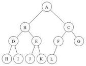
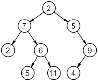
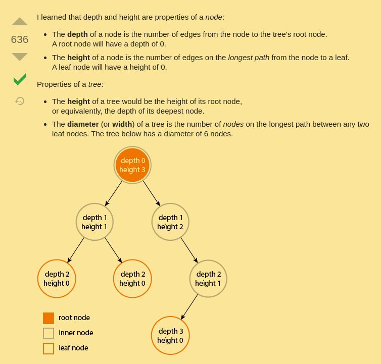
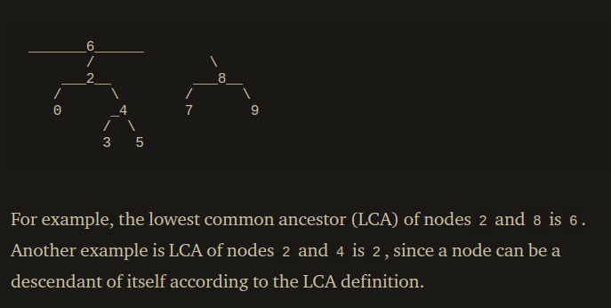
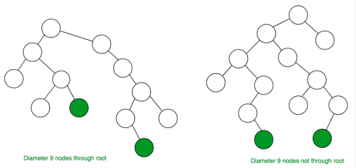
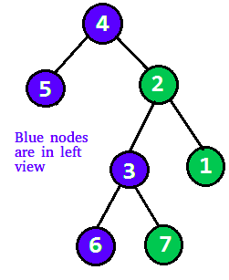
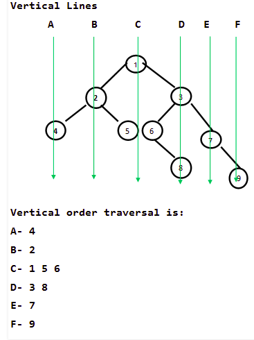
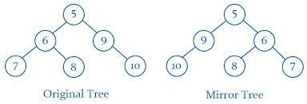
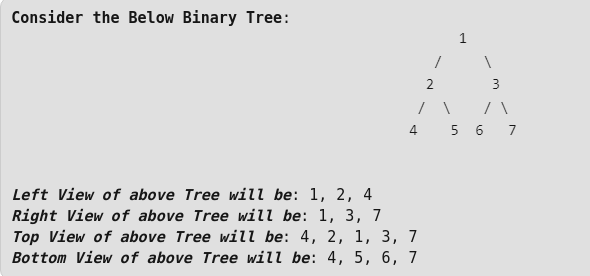

## Tree and Binary Tree

* **Tree**: non-linear data structure where each node is connected t a number of nodes using pointers or references. 

* **Binary tree**: is a tree data structure in which each node has at most two children, which are referred to as the left child and the right child.Each element in the Tree Has at most a left and right child.

* **Root**: first node of the three (it has no parent node). 

* **Siglings**: children nodes of same parents are called siblings of each other. 

* **Full binary tree**: everynode has 0 or  children. 

* **Leaf node**: node without children ```(node->right = NULL && node->left = NULL); ```

* **Complete binary tree**: all levels are completely filled execept the last level and the last level has all keys as left as possible.



* **Perfect Binary Tree**: all leaf nodes are at the same level.





* **Edge**: is a link connecting any two nodes in the three. 

* **Height of a Tree**: total numbers of level in the three or the path from the root node to the node present at the last level.

* **Applications:** Usually used when we store information that naturally forms a hierarchy or when we need to execute fast search operation.

* **Size**: Number of nodes in the Binary Tree. 

* **Max number of nodes at level l**: 2^(l-1). Level of root is 1; 

* **Maximum number of nodes** in a binary tree of **height** 'h' is (2h – 1).
* **minimum possible height or min number of levels** of a tree with N nodes is Log2(N+1). 

```
#include <iostream>
using namespace std;

struct node 
{ 
    int data; 
    struct node *left, *right; 
}; 
  
// A utility function to create a new BST node 
struct node *newNode( int item) 
{ 
    struct node *temp = new node; 
    temp->data = item; 
    temp->left = temp->right = NULL; 
    return temp; 
};


struct node * insert(struct node *root, int element)
{
    if(root == NULL)
        return newNode(element);
    if(root->data > element)
        root->left = insert(root->left, element);
    else if (root->data < element)
        root->right = insert(root->right, element); 
    return root;
}


bool search(struct node *root, int element)
{
    if (root->data == element)
        return true;   
    if(root->data > element)
        return search(root->left, element);
    else if(root->data < element)
        return search(root->right, element);
    return false;
}


/* Given a non-empty binary search tree, return the node with minimum 
key value found in that tree. Note that the entire tree does not 
need to be searched. */
struct node * minValueNode(struct node* node) 
{ 
    struct node* current = node; 
  
    /* loop down to find the leftmost leaf */
    while (current && current->left != NULL) 
        current = current->left; 
  
    return current; 
} 

struct node* remove(struct node *root, int element)
{
    // Case 1: the BST is empty
    if(root == NULL) return root;

    if(root->data > element)
        root->left = remove(root->left, element);
    else if( root->data  < element)
        root->right = remove(root->right, element);

    // We are in the node to remove  
    else
    {
        // Case 1: One of the childre is NULL
        if(root->left == NULL)
        {
            struct node *temp = root->right;
            free(root);
            return temp;
        }
        else if(root->right == NULL)
        {
            struct node *temp = root->left;
            free(root);
            return temp;
        }

        // Case 2: The node has two children
           // node with two children: Get the inorder successor (smallest 
        // in the right subtree) 
        struct node* temp = minValueNode(root->right); 
  
        // Copy the inorder successor's content to this node 
        root->data = temp->data; 
  
        // Delete the inorder successor 
        root->right = remove(root->right, temp->data); 
    } 
    return root; 
    
}

// Driver Program to test above functions
int main()
{
    /* Let us create following BST
          50
        /     \
       30     70
      / \    / \
     20 40  60 80 */
    struct node *root = NULL;
    root = insert(root, 50);
    insert(root, 30);
    insert(root, 20);
    insert(root, 40);
    insert(root, 70);
    insert(root, 60);
    insert(root, 80);

    // print inoder traversal of the BST
    inorder(root);

    return 0;
}
// Source: GeeksforGeeks
```

Rember that in **BT** is not allowed to have duplicate elements, for this reason for every insert operation, we need to check first if element exists using the [exists checker function](#Check-if-an-element-exists) and the [create node function](#Create-new-node)

### Traversal

* **Traversal** is a process that visits all the nodes in the tree. Since a tree is a nonlinear data structure, there is no unique traversal. We will consider several traversal algorithms with we group in the following two kinds:
1. **depth-first traversal**.
2. **breadth-first traversal**.


There are Three types of depth -First-Traversals:

1. Inorder (Left, Root, Right) : 4 2 5 1 3
```
void inorder(struct Node *root)
{
    if(root == NULL)
        return; 
    inorder(root->left);
    cout <<root->data << " ";
    inorder(root->right);
}
```
2. Preorder (Root, Left, Right) : 1 2 4 5 3
```
void preoder(struct Node *root)
{
    if(root == NULL)
        return; 
    cout <<root->data << " ";
    preoder(root->left);
    preoder(root->right);
}
```
3. Postorder (Left, Right, Root) : 4 5 2 3 1
```
void postorder(struct Node *root)
{
    if(root == NULL)
        return; 
    postorder(root->left);
    postorder(root->right);
    cout <<root->data << " ";
}
```

There is only one kind of breadth-first-traversal, the **Breadth First or Level Order Traversal** : 1 2 3 4 5


### Breath First Search

Breath first search is also used for **level order traversal**.

```
    // Having this Binary Tree
    //      1
    //     / \
    //    2   3
    //   / \
    //  4   5
    // The level order traversal will be: 1 2 3 4 5
```

* Space complexity O(N);
* Time complexity  O(N);

1. Create empty queue
2. Push root to the queue
3. While queue is not empty:
    3.1 Pop the top node form queue and print it
    3.2 Enqeueu (insert) node's children (first left and then right)

```
void levelOrderTraverse(Node *root)
{
    if(root == NULL) return;

    // Create queue (Point 1)
    queue<Node *> myQueue;

    // Insert root in the queue (point 2)
    myQueue.push(root);

    // While queue is not empty: pop front node and then push left and right child
    Node *node;
    while( !myQueue.empty() )
    {
        // Print fron of queue
        node = myQueue.front();
        cout << node -> data << " ";
        myQueue.pop();

        // Enque left child
        if(node->left != NULL)
            myQueue.push(node->left);
        if(node->right != NULL)
            myQueue.push(node->right);
    }
}
```

Pseudo code of the algorithm:
/*Function to print level order traversal of tree*/
printLevelorder(tree)
for d = 1 to height(tree)
   printGivenLevel(tree, d);

/*Function to print all nodes at a given level*/
printGivenLevel(tree, level)
if tree is NULL then return;
if level is 1, then
    print(tree->data);
else if level greater than 1, then
    printGivenLevel(tree->left, level-1);
    printGivenLevel(tree->right, level-1);

```
// Recursive CPP program for level 
// order traversal of Binary Tree  
  
/* Function to print level  
order traversal a tree*/
void printLevelOrder(node* root)  
{  
    int h = height(root);  
    int i;  
    for (i = 1; i <= h; i++)  
        printGivenLevel(root, i);  
}  
  
/* Print nodes at a given level */
void printGivenLevel(node* root, int level)  
{  
    if (root == NULL)  
        return;  
    if (level == 1)  
        cout << root->data << " ";  
    // We are not in the root node of the BST.
    else if (level > 1)  
    {  
        printGivenLevel(root->left, level-1);  
        printGivenLevel(root->right, level-1);  
    }  
}  
  
/* Compute the "height" of a tree -- the number of  
    nodes along the longest path from the root node  
    down to the farthest leaf node.*/
int height(Node* root) {
    if(root == NULL)
        return 0;
    int l = height(root->left);
    int r = height(root->right);
            // Return the biggest counter
    return l > r ? l+1 : r+1; 
} 
```


### Height vs Depth

During my first approach to Tree, I swapped the meaning of Height and Depth. 



The height of a node is the largest number of edges in a path from that node to a leaf node.
[Video Tutoral: find heaight of a BT](https://www.youtube.com/watch?v=AWIJwNf0ZQE)
```
int height(Node* root) {
    if(root == NULL)
        return 0;
    int l = height(root->left);
    int r = height(root->right);
            // Return the biggest counter
    return l > r ? l+1 : r+1; 
}
```
The height of a binary tree is the largest number of edges in a path from the root node to a leaf node. Essentially, it is the height of the root node. Note that if a tree has only one node, then that node is at the same time the root node and the only leaf node, so the height of the tree is 0. On the other hand, if the tree has no nodes, it’s height is -1.

The size of a binary tree is the total number of nodes in that tree.
[Video-Tutorial: Find size of a tree](https://www.youtube.com/watch?v=C128SsWVLkc)
The depth of a node is the number of edges in the path from the root node to that node.

The depth of a binary tree is usually used to refer to the height of the tree.

###### Source: Stackoverflow

### Count Number of leaf nodes

Leaf Node: a node that has both left and right child NULLS;
```
if(node->left == NULL && node->right)
    cout<<"YES! It's a leaf node"<<endl;
```
We have to two different ways to actually count the number of leaf nodes, using a level order traversal approach or with recursion
```
int countLeaves(Node* root)
{
    Node *node = root;
    if(node == NULL)
        return 0;
    else if(node ->left == NULL && node ->right == NULL)
        return 1; 
    else
        return countLeaves(node->left) + countLeaves(node->right);
}
```
As idnicated before we can also use the level order traversal
```
int CountNumberOfLeaves(Node * root)
{
    if(root == NULL)
        return 0; 
    int number_leaf_nodes = 0;
    
    Node * temp;
    queu<Node *>q;
    q.push(root); 
    
    while(!q.empty())
    {
        temp = q.front();
        q.pop();
        
        if(temp->left != NULL)
            q.push(temp->left);
        if(temp->right != NULL )
            q.push(temp->right);
        if(temp->left == NULL && temp->right == NULL)
            number_leaf_nodes++;
    }
    
    return number_leaf_nodes;
}
```

### Max Depth

The max depth is the number of nodes along the longhest path from the root node down to the farthest leaf(external) node.

```
int maxDepth(struct node *root)
{
    if(root == NULL)
        return 0; 
    else
    {
        unsigned long int leftDepth = maxDeth(node->left);
        unsigned long int rightDepth = maxDepth(node->right);

        // Return the biggest counter
        if(leftDepth > rightDepth)
            return leftDepth+1;
        else    
            return rightDepth+1;
    }
}
```

* [Extra information: Tutorial 1](https://www.cs.cmu.edu/~adamchik/15-121/lectures/Trees/trees.html)
* [Extra information: Tutorial 2](http://cslibrary.stanford.edu/110/BinaryTrees.html)

## Print node at k distance from  root 

```
void print_level_k(node *root, int k)
{
    if(root == NULL)
        return;
    if( k == 0)
    {
        cout <<root->data<<endl;
        return;
    }
    else
    {
        print_level_k(root->left, k-1);
        print_level_k(root->right, k-1);
    }
}
```

## Count number of  Leaf nodes in a Binary Tree

* **Leaf node**: It has both left and right child nodes NULL;
```
int countLeaf(Node* root)
{
    Node *node = root;
    // Case 1: there are no nodes at all
    if(node == NULL)
        return 0;
    // Case 2: There is just a root
    else if(node ->left == NULL && node ->right == NULL)
        return 1; 
    // Case 3: We need to iterate recursively the three to count the leafnodes
    else
        return countLeaves(node->left) + countLeaves(node->right);
}
```


## Lowest Common Ancestor (LCA)

According to the definition of LCA on Wikipedia: “The lowest common ancestor is defined between two nodes v and w as the lowest node in T that has both v and w as descendants (where we allow a node to be a descendant of itself).”


A better definition could be: The LCA or Lowest Common Ancestor of any two nodes N1 and N2 is defined as the common ancestor of both the nodes which is closest to them. That is the distance of the common ancestor from the nodes N1 and N2 should be least possible.


Algorithm:
1. FInd path from root node to node n and store it in a vector / array
2. FIdn pathfrom root node to n2 and store it in another vector / array
3. Traverse both paths until the values in arrays are same and return the common element just before the mismatch. 


```
// k : Value of the node to find 
bool findPath(Node *root, vector<int> &path, int k)
{
    if(root == NULL)
        return false;
    
    // Store node in path vecotr and remove if if there is no path from root to k 
    path.push_back(root->key);

    // If k is equals to the root valu e
    if(root->key == k)
        return true; 
    
    // check if k is in left or right sub-treee
    if(  (root->left && findPath(root->left, path, k))  || (root->right && findPath(root->right, path, k)))
        return true; 

    // If it is not presente in left or right subtreee
    path.pop_back();

    return false;  
}


int findLCA(Node *root, int n1, int n2)
{
    // Create vectors for storing possible paths
    vector<int> path1, path2; 

    // FInd possible path from root to n1 and root to n2, if one of the them do not exists, return -1;
    if(!findPath(root, path1, n1) || !findPath(root, path2, n2))
        return -1; 

    int i;

    // Iterate both vector until there is no a mismatch
    for(i=0; i < path1.size(); && i < path2.size(); i++)
    {
        if(path1[i] != path2[i])
            break;
    }
    // Retunrn prev element to the mismatch. 
    return path1[i-1];
}
```

A recursive approach could be
```
struct node *lca(struct node* root, int n1, int n2)
{

    if (root == NULL) 
        return NULL;  

    // If both n1 and n2 are smaller 
    // than root, then LCA lies in left  
    if (root->data > n1 && root->data > n2)  
        return lca(root->left, n1, n2);  

    // If both n1 and n2 are greater than  
    // root, then LCA lies in right  
    if (root->data < n1 && root->data < n2)  
        return lca(root->right, n1, n2);  

    return root; `
}
```
###### Souce: Miss Deeksha Sharm - Medium

```
// return the Height of the given Binary Tree
int height(Node* root)
{
    Node *node = root;
   if(node == NULL)
    return 0;
   return 1 + max(height(node->left), height(node->right));
}
```
## Diameter of a Binary Tree
Diameter (also width): number of nodes on thelongest path between two end nodes.
The diameter of a tree T is the largest of the following quantities:
* The diameter of the left subtreee
* Diameter of right subtree
* Longest path between leaves that goes thourhg the root T (computed from the height of  a tree).


```
// Time complexity for finding the diameter: O(N^2);


/* The function Compute the "height" of a tree. Height is the 
    number f nodes along the longest path from the root node 
    down to the farthest leaf node.*/
int height(struct node* node)
{
    /* base case tree is empty */
    if(node == NULL)
        return 0;
    
    /* If tree is not empty then height = 1 + max of left 
        height and right heights */
    return 1 + max(height(node->left), height(node->right));
} 

int diameter(Node *head)
{
    if(head == NULL)
        return 0;
    else
    {
        left_height = height(root->left);
        right_height = height(root->right);

        // Get the diameter of left and right sub-trees
        left_diameter = diameter(root->left);
        right_diameter = diameter(root->right)

        return max(left_height + right_height +1, max(left_diameter, right_diameter));
    }
}
```
###### Image by Geeks for Geeks

## Left or Right view of Binary Tree



###### Left view, images: Geeks for Geeks
## Check if a tree is balanced

## Ancestors 
* [Print Ancestors of a given node](https://www.geeksforgeeks.org/print-ancestors-of-a-given-node-in-binary-tree/)
* [Lowest common Ancestor of a given binary tree](https://www.geeksforgeeks.org/print-ancestors-of-a-given-node-in-binary-tree/)


## Binary Tree (BT), convert it to a Doubly Linked List(DLL) In-Place.
Recursively look for the node with no grandchildren and both left and right child in the left sub-tree. Then store node->right in temp and make node->right=node->left. Insert temp in first node NULL on right of node by node=node->right. Repeat until it is converted to linked list.

Flatten operation: convert from BT to Linked list
Inorder printing of the BT allws to have the flatted BT elements in increasing order

```
void flatten(Node * root)
{
    if(root == NULL || root->left == NULL && root->right == NULL)
        return; 
    if(root->left != NULL)
    {
        //Move the left subtree in the right subtree
        if(root->left != NULL)
        {
            flatten(root->left);

            Node * tempraryRight = root->right;
            root->right = root->left;
            root->left = NULL;

            // Find the position to insert the new node
            Node *t = root->right; 
            while(t->right != NULL)
                t = t->right;
        
            // Insert the value
            t->right = temporaryRight;
        }
        // Call the same function for root->ight
        flatten(root->right);

    }
}
```

## Vertical traversal of Binary Tree
Traverse a Binary Tree vertically means ge the minimum and maximum horizontal distance with respect to root. 

###### Image provided by Geeks For Geeks
How do a calculate the vertical sum of a given BST?

## Vertical Zig-Zag Traversal of a Tree

Vertical Zig-Zag traversal:
1. Print eleemnt sof first level from right to left, then skip to next level;
2. Print element of the last order from left to right, if there are no eleemnt left, skip to previuos level.
3. Repeat step 1 and 2 until there are nodes left.


[Have a look to the lecture provided by Geeks for Geeks](https://www.geeksforgeeks.org/vertical-zig-zag-traversal-of-a-tree/?ref=rp)

```
// min: min horizonal distance from root
// max: max horizonal distance from root
//  horizontal_distnace: horizonal distance of current from node from root
void findMinMax(Node *root, *min, *max, horizontal_distance)
{
    if(root == NULL)
        return;
    if(horizontal_distance < min) *min = horizontal_distance;
    else if( horizontal_distance > max) *max = horizontal_distance;

    findMinMax(root ->left, min, max, horizontal_distance-1);
    findMinMax(root -> right, min, max, horizontal_distance+1);
}

void printVerticalLine(Nod * root, line_number, horizontal_distance)
{
    if(root == NULL)
        return; 
    if(horizontal_distance == line_numnber)
        cout << root -> data; <<endl;
    printVerticalLine(root->left, line_number, horizontal_distance-1);
    printVerticalLine(root->right, line_number, horizontal_distance+1);
}
// The main function that prints a given binary tree in 
// vertical order
void verticalOrder(Node *root)
{
    // Get min and max distance respect to the root
    int min = 0,  max =0;
    findMinMax(root, &min, &max, 0);

    /* Iterate all possible vertical lines starting from the leftmost and print
     line by line */
     for(int line_number = min, line_number <= max; line_number++)
     {
         printVerticalLine(root, line_number, 0);
         cout <<endl;
     }
}

```

[Find distance between root and a given node](https://www.youtube.com/watch?v=pavbfn1FHrs&feature=emb_rel_end)

## Binary Indexed Tree or Fenwick tre

Binary Index Tree is repesents as an array. 
Each node of the BIT stores the sum of some element of the input array and of course, the size of the BIT si equal to the size of the input array. 

For find sum of first i elements & update value of a specific element, it takes 0(Log n).

BI Tree for an arrays arr[] has the following operations:
* update(): updates BI tree for operation arr[index] += val
* getSum(): returns sum of arr[0..index]

### Convert BT into its Mirror Tree

Example of Mirror Tree: Mirror of a Binary Tree T is another Binary Tree M(T) with left and right children of all non-leaf nodes interchanged.

##### Source image: pinterest.ch

```
void mirror(Node *node)
{
    if(node == NULL)
        return;
    else
    {
        Node *temp;

        mirror(node->left);
        mirror(node->right);

        // Swap pointer of the current node
        temp = node->left;
        node->left = node->right;
        node->right = temp; 
    }
}
```

#### How to we create it?
1. We first initialize all values in BITree[] as 0.
2. We call update() operation for all indexes to insert values according to given array. 


## Delete node from BST

If we have 3 cases:
1. Node is a leaf node:  it does not violate any BST property if we delete it. Simply remove from the tree.
2. Node has 1 child: the child node must be moved in the parent node.  We do so copying the child to the node and delete the child.
3. Node has 3 children: we need to move all the subtree. 

```
struct node* deleteNode(struct node* root, int key)
{
    // base case
    if (root == NULL) return root;

    // If the key to be deleted is smaller than the root's key,
    // then it lies in left subtree
    if (key < root->key)
        root->left = deleteNode(root->left, key);

    // If the key to be deleted is greater than the root's key,
    // then it lies in right subtree
    else if (key > root->key)
        root->right = deleteNode(root->right, key);

    // if key is same as root's key, then This is the node
    // to be deleted
    else
    {
        // node with only one child or no child
        if (root->left == NULL)
        {
            struct node *temp = root->right;
            free(root);
            return temp;
        }
        else if (root->right == NULL)
        {
            struct node *temp = root->left;
            free(root);
            return temp;
        }

        // node with two children: Get the inorder successor (smallest
        // in the right subtree)
        struct node* temp = minValueNode(root->right);

        // Copy the inorder successor's content to this node
        root->key = temp->key;

        // Delete the inorder successor
        root->right = deleteNode(root->right, temp->key);
    }
    
    return root;
}
```

## Definition of inorder successor
* The inorder successor is the next node that would show in case of inorder
travers of the tree.
### Left, right, Top and Bottom view of a Binary Tree


* Left view: set of nodes that can be viewed from the left hand side. Pratically, it is the first node of every level. [View the Video-Tutorial provided about Left view](https://www.geeksforgeeks.org/print-left-view-binary-tree/)
```
// left view  Time complexity:  O(N) | Space complexity: O(1)
void leftViewHelper(Node * root, int level, int *max_level)
{
    // Once we have a leaf node, we return to the prev node
    if(root == NULL)
        return;

    // Check if it is the first node of its level
    if(*max_level < level) 
    {
        cout << root->data << " ";
        *max_level = level;
    }

    // Recursively iterate left and right subtrees
    leftViewHelper(root->left, level+1, max_level);
    leftViewHelper(root->right, level+1, max_level);
}

void leftView(Node *root)
{
    int max_level = 0;
    leftViewHelper(root, 1, &max_level);
}
```

```
// Recursive function to print 
// right view of a binary tree. Time: O(N) - Space(1) 
void rightViewHelper(Node *root,  
                   int level, int *max_level) 
{ 
    // Base Case 
    if (root == NULL) return; 
  
    // If this is the last Node of its level 
    if (*max_level < level) 
    { 
        cout << root->data << " "; 
        *max_level = level; 
    } 
  
    // Recur for right subtree first,  
    // then left subtree 
    rightViewUtil(root->right, level + 1, max_level); 
    rightViewUtil(root->left, level + 1, max_level); 
} 
  
// A wrapper over rightViewUtil() 
void rightView(struct Node *root) 
{ 
    int max_level = 0; 
    rightViewHelper(root, 1, &max_level); 
} 
```
## Threaded Binary Tree

Threaded BT: used to make inorder traversal faster without stack and withot recursion. All right hand childs, instead to point to NULL, will point to the inrder success of the node (if it exists); 

* Single Threaded: a NULL pointer is made to point to the inorder successor (if exists);
* Double threaded: oth leaft and right children will point to the inorder prefecessor and inorder successor respectively. 

### General notes

* Number of BST = (2n)! / n! * (n+1)!
* Average depth of Binary Search Tree: O(log n).  

### AVL TREE

* AVL TREE: is a self-balancing BST. 
* The height of left and right ubtrees cannot be mores than one.
* Search, Max, min, insert, delete operations takes O(H) time (h: height of BST).
* If AVL Tree is balanced,height is O(Logn).

## Practice with Binary Tree

Perfect, above you have find all the definition that you will need to know before to solve the following exercises. 
* Get the Height of a Binary Tree
* Minimum elment in BST
* Clone a Binary Tree
* Size of a Binary Tree
* Inorder, postorder, preorder traversal
* Maximum Node Level
* Remove Heal Nodes
* K distance from root
* Sum of Binary Tree
* Sum of Leaf Nodes
* Sum of right Leaf Nodes
* Count Non-leaf Nodes
* Minimum Depth of a Binary Tree
* Make a Binary Tree from Linked List
* Determine if two Trees are identical
* Perfect Binary Tree
* Vertical Sum

[More exercises](https://practice.geeksforgeeks.org/explore/?category%5B%5D=Tree&page=1)

