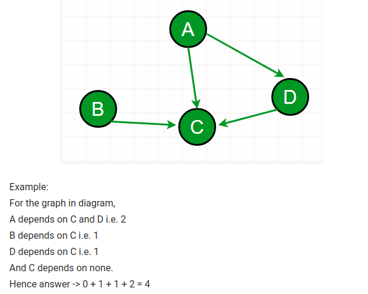
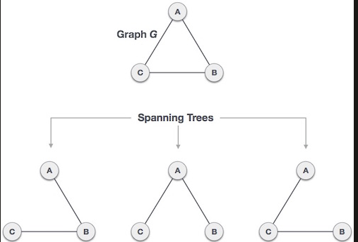

## Graph

Is a non/linear data structure consisting of nodes and edges. The nodes are also called vertices and the edges are lines
or arcs that connect any two nodes in the graph.

### Formal Definition of a graph
A Graph consists of a finite set of vertices(or nodes) and set of Edges which connect a pair of nodes.


### Types of graphs

* **Undirected Graph** :order of the vertices in the pairs does not matter. Edges are directionless (also said bi-directional).
* **Directed Graph**: edges are directed in a single direction.
* **Cycling Graph**:A cyclic graph is a directed graph with at least one cycle. 
A cycle is a path along the directed edges from a vertex to itself. The vertex labeled graph above as several cycles. One of them is 2 � 4 � 5 � 7 � 6 � 2
* **Weighted Graph**: is a labelled graph where the label is usually used for arithmetic operators.
* **Directed acyclic graph**: graphically present with arrows that indicates a path between an edge a to and edge b. As the
name suggest, it does not contains and cycle / loop.


* Degree of a node: number of edges linked to the node; It is the sums of the indegree and outdegree. 


### Graph representations

Two are the most commonly used representations of a graph.
1. **Adjacency Matrix:** VxV matrix (V: number of vertices). If adj[i][j] = 1,means that there is an edge between vertex i and j. Adjacency matrix for undirected graph is always symmetric. If adj[i][j] = w, then there is an edge from edge from vertex i to vertex j with weight w.  Add a vertex takes O(V^2) time.
2. **Adjacency List:** implements using an array of lists. 
 
## How to implement the Adjacency list

 ```
// Add a new node 
void addEdge(vector<int>adj[], int u, int v)
{
    adj[u].push_back(v);
    adj[v].push_back(u);
}

printGraph(vector<int> adj, int v)
{
    for(int i =0; i < v; i++)
    {
        cout << i;
        for(int x : adj[i])
            cout << "-> "x << " ";
    }
    cout <<endl;
}

int main()
{
    int v = 4;
    vector<int> adj[v];
    addEdge(adj, 0, 1);
    addEdge(adj, 0,2);
    addEdge(adj, 1, 2);
    addEdge(adj, 1, 3);

    printGraph(adj, v);
    return 0; 
}

```


* [Source - Grpah representation Geeks for Geeks](https://www.geeksforgeeks.org/graph-and-its-representations/)
```

int sum_of_depency(vector<int>adj[], int V)
{
    int sum = 0; 
    //  Sum the size at each vector's index
    for(int i=0; i < V; i++)
        sum += adj[i].size();
    
    return sum;
}

// Driver code 
int main() 
{ 
    // V: Number of vertex. 
    int V = 5; 
    vector<int> adj[V]; 
    addEdge(adj, 0, 1); 
    addEdge(adj, 0, 4); 
    addEdge(adj, 1, 2); 
    addEdge(adj, 1, 3); 
    addEdge(adj, 1, 4); 
    addEdge(adj, 2, 3); 
    addEdge(adj, 3, 4); 
    printGraph(adj, V); 
    return 0; 
} 
```

## Depency Graph

A depency graph is a directed graph representing dependencies of several objects towards each other. If it possible to derive an evaluation order or theabsence of an evaluation order that repspects the given dependencies from the dependency graph.



In a Graph we use the array of visited to avoid to process again the same node more than one time considering that in the graph there could be cycles. 

* [BFT: Breath First search](https://www.geeksforgeeks.org/breadth-first-search-or-bfs-for-a-graph/)

In the mathematical theory of directed graphs, a graph is said to be strongly connected if every vertex is reachable from every other vertex. The strongly connected components of an arbitrary directed graph form a partition into subgraphs that are themselves strongly connected.

Bipartite graph: is a graph whise vertices can be divided into two disjoint and indepent sets U and V such that every dege connects a vertex in U t oone in V. Vertex set U and V are usually claled the parts of the graph. 

## Breadth First Traverse or BFS

It is a traversal mechanism used in Trees, Binary Tree and Graph. 

It basically print all the nodes reachable from our root node (or source node)

Startin from a node, we print the nodes closest to the source node(root). After we print the roots "fiends", we keep going printing all the nodes closest to the current node.

It is necessary to use a vector of bools for check that a node is visited just once.

BFS can be used for:
* Find shorted path between A and B.
* Social Netowking Search
* Shortest path in unweighted Graph
* Cycle detection
* Broadcasting
* Crowler in Search Engine
* Peer To Peer Networks
* Garbage Collections

**Traverse algorithm of Breath First Traverse:**
1. Create a boolean array say visited[] of size V+1;
2. Create a queue, root (vertex that works as starting point) in the queue and mark visited[s] =true (as visited);
3. Until queue is not empty, loop:
    3.1 Pop eleemnt from queue and print popped element
    3.2 Traverse all of the vertices adjacent to the vertex poped from queue.
    3.3. If any of the adjancent vertex is not already visited, mark it visited and push it to the queue. 

```
#include<bits/stdc++.h>
using namespace std;

void addEdge(vector<int> adj[], int u, int v)
{
    adj[u].push_back(v);
    adj[v].push_back(u);
}

void BFS(vector<int> adj[], int V, int source)
{
    // Create array of boolean of size V+1
    bool visited[V+1];

    // Set all vertices as not visited
    for(int i = 0; i < V; i++)
        visited[i] = false;

    // Create queue to perform BFS
    queue<int>q;

    // Set root vertices as visited and push into the queue
    visited[souce] = true;
    q.push(source);

    // Start point 3 and perform 3.1, 3.2 and 3.3 until queue is not empty
    while(!q.empty())
    {
        int u = q.front();
        q.pop();

        cout << u << " ";

        for(int v : adj[u])
        {
            if(visited[v] == false)
            {
                visited[v] = true;
                q.push(v);
            }
        }
    }
}

int mai()
{
    int V = 4;
    vector<int> adj[V+1];
    addEdge(adj, 1, 2);
    addEdge(adj, 1, 3);
    addEdge(adj, 2, 4);

    BFS(adj, V);

    return 0;
}

```

* [BFS for competitive Programing](https://www.geeksforgeeks.org/bfs-using-stl-competitive-coding/)
* [Video-Tutorial: How Breath First works](https://www.youtube.com/watch?v=0u78hx-66Xk&feature=youtu.be)


## Depth First Seach or DFS

* Depth first Traversarst Traversal of  a tree. 
* Used for unconnected and undirected graph. 
* The algorithm starts at the root node(select some arbitrary node as the root in case of the graph) and explores as far as possible along each branch before backtracking. 

It is used for:
1. For a weighted graph, DFS traverls poduces the minmum spanning tree and all pair shorted tree.
2. Detect cycle in a graph
3. Path finding: 
4. Check if a graph is bipartirte.
5. Find strongly connected components. 
6. Solve puzzles with only one solution. 

Mind that:
* Unlike trees, a graph may contains cycles. We use so boolean visited array.

```
void DFSUtil(int source, bool visited[])
{
    visited[source] = true;
    cout << source << " ";

    // For all the vertices adjance to the source vertex
    list<int>::iterator i;
    for(i = adj[source].begin(); i !=  adj[source].end(); ++i)
    {
        if(!visited[*i])
            DFSUtil(*i, visited);
    }
}

void DFS(int source)
{
    bool *visited = new bool[V];
    for(int i =0; i < v; i++)
        visited[i] = false;

    DFSUtil(source, visited);
}
```
Generally, with DFS we have :
* Time complexity: O(V + E), where V is the number of vertices and E is the number of edges in the graph.
* Space Complexity: O(V).
Since, an extra visited array is needed of size V

* [Video-Turorial: How Depth First works](https://www.youtube.com/watch?v=Y40bRyPQQr0)


```


```


## Spanning tree

* Is a subset of a Graph G, which has all the vertices covered with minimum possible number of edges. 
* It does not have cycles.
* A complete undirected graph can have a max of n^n-2 number of spannig trees(where n is the number of vertices).  
* Add one edge to the spanning tree will create a circut or loop.
* Removing one degre from the S.T. will make the graph disconnected. 
* All possible spanning trees have same number of edges and vertices.


###### Source: tutorial-point

## Types of edges


###### Source: Wikipedia

## Detect a cycle


* **forward edges**: which point from a node of the tree to one of its descendants.
* **back edges**: which point from a node to one of its ancestors.
* **cross edges**: which do neither.

We can detect a cycle using Depth first Traversal. If we reach a vertex that is already in the recursion stack, there is a cycle. A cycle is created always from a back edge node.  

Algorithm:
1. Build your graph
2. Initialize recursively the current vertex, visited, and recursion stack.
3. Mark the current node as visited and also mark the index in recursion stack.
4. Find all the vertices which are not visited and are adjacent to the current node. Recursively call the function for those vertices, If the recursive function returns true, return true.
5. If the adjacent vertices are already marked in the recursion stack then return true.
6. Create a wrapper class, that calls the recursive function for all the vertices and if any function returns true return true. Else if for all vertices the function returns false return false.

**How to detect a cycle in both directed and undirected graphs:**

```
// Sorce Geeks for geeks
bool isCyclic()
{
    bool *visited[V];
    bool *recStaack[V];
    for(int i =0; i <V; i++)
    {
        visited[i] = false;
        recStack[i] = false;
    }

       // Call the recursive helper function to detect 
    // cycle in different DFS trees
    for(int i = 0; i < V; i++)
        if (isCyclicUtil(i, visited, recStack))
            return true;

    return false;
}

// Utility function to detect cycle in a Graph
bool isCyclicUtil(int v, bool visited[], bool *recStack)
{
    if(visited[v] == false)
    {
        // Mark the current node as visited and part of recursion stack
        visited[v] = true;
        recStack[v] = true;

        // Recur for all the vertices adjacent to this vertex
        list<int>::iterator i;
        for(i = adj[v].begin(); i != adj[v].end(); ++i)
        {
            if ( !visited[*i] && isCyclicUtil(*i, visited, recStack) )
                return true;
            else if (recStack[*i])
                return true;
        }
    }
    recStack[v] = false;  // remove the vertex from recursion stack
    return false;
}


```

[Geeks for Geeks detect cycle lesson](https://www.geeksforgeeks.org/detect-cycle-in-a-graph/)

* [Graph Tutorial and Exercises list](https://www.quora.com/How-can-I-be-good-at-graph-theory-based-programming-problems-in-competitive-programming/answer/Sameer-Gulati-3?ch=10&share=fed73688&srid=oeMh)
* [LeetCode Graph core concepts and exercises](https://leetcode.com/discuss/general-discussion/655708/graph-problems-for-beginners-practice-problems-and-sample-solutions)

## Bellman-Ford VS Dijkstra

Both algorithms are used to find the shortest path.

* **Bellman-Ford**: Complexity time: O(VE). It is simpler to implement compared to Dikstra and it works also for graph with negative weights. 

* **Dijkstra**: for weighted graph, it works just if all the wights are positive. It time complexity is: O(VlogV), where V is the number of verteces. Dijkstra is particularly fast because it uses the Fibonacci Heap. 