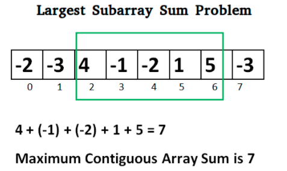

## Must know algorithms checklist

The following list represents an algorithms checklists that you should know in order to ice your interview.

##  Prefix Sum

Given an array arr[] of size n, its prefix sum array is another array prefixSum[] of the same size, such that the value of prefixSum[i] is arr[0] + arr[1] + arr[2] … arr[i].

nput  : arr[] = {10, 20, 10, 5, 15}
Output : prefixSum[] = {10, 30, 40, 45, 60}


```
void getPrefixSum(int arr[], int n, int prefixSum)
{
    prefixSum[0] = arr[0];

    for(int i =0; i < n; i++)
        prefixSum[i] = arr[i] + prefixSum[i-1];
}
```


* Sliding Window Technique
* Binary search
* GCD of two numbers in LogN
* Sieve of Eratosthenes, Segmented Sieve
* Modular arithmetic
* Bit Manipulation
* Greedy Algorithms
* Two Pointers
### Kadane's Algorithm (larghest contiguos subarray)
Say we are given an array containing positive and negative numbers and we need to find the sum of the largest contiguous subarray from the given array. We can find the largest sum with the divide and conquer approach or brute force with O(NLogN) and O(N*N). But, with the help of Kadane’s algorithm we can reduce the complexity of finding the largest subarray sum to O(N).



```
Initialize:
    max_so_far = INT_MIN
    max_ending_here = 0

Loop for each element of the array
  (a) max_ending_here = max_ending_here + a[i]
  (b) if(max_so_far < max_ending_here)
            max_so_far = max_ending_here
  (c) if(max_ending_here < 0)
            max_ending_here = 0
return max_so_far
```

[Resource: GeeksForGeeks](https://www.geeksforgeeks.org/largest-sum-contiguous-subarray/)


###  Meet in the Middle Algorithm

Given a set of n integers where n <= 40. Each of them is at most 10^12, determine the maximum sum subset having sum less than or equal S where S <= 10^18.


* Recursion
* Divide and Conquer
Next Greater/Smaller Element using Stack
Problems related to Parenthesis
Backtracking
Problems related to Constructive Algorithms
Problems related to Heap
Inclusion-Exclusion Principle
Finding nCr and nPr for Queries
Rabin Karp Algorithm
Prefix Function
KMP Algorithm
Z-Function
Manacher's Algorithm
DFS/BFS Traversal in Graph/Tree
Diameter of Tree
Euler Tour of Tree
Finding LCA using Euler Tour
Finding LCA using Binary Lifting
### Distance between two nodes
Find the distance between two keys in a binary tree, no parent pointers are given. The distance between two nodes is the minimum number of edges to be traversed to reach one node from another.

Required before to approach this algorithm:
* Find common anchestor
* Find least common anchestor


Subtree Problems
Connected Components, Topological Sort, Cycle Detection, Bipartite Check-in Graph
Dijkstra's Algorithm
Bellman-Ford Algorithm
Floyd Warshall Algorithm
Bridges in Graph
Prim's Algorithm
0/1 BFS
Dynamic Programming, DP with Bitmask, DP on trees
Disjoint Set
Kruskal's Algorithm
Fenwick Trees, Binary Lifting on Fenwick Tree
Matrix Exponentiation
Sqrt Exponentiation
Segment Trees
Lazy Propagation on Segment Trees
Sprague/Grundy Theorem
Heavy Light Decomposition
FFT/NTT